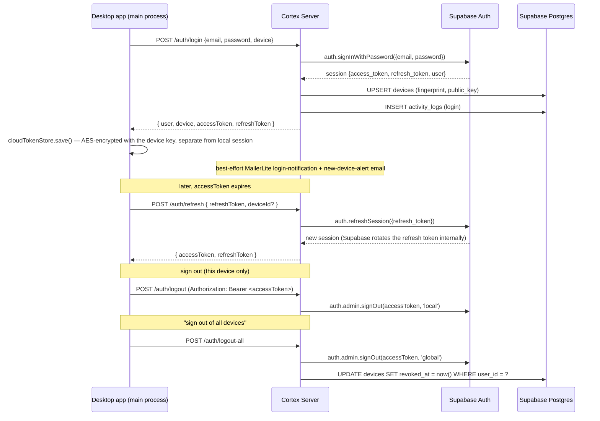
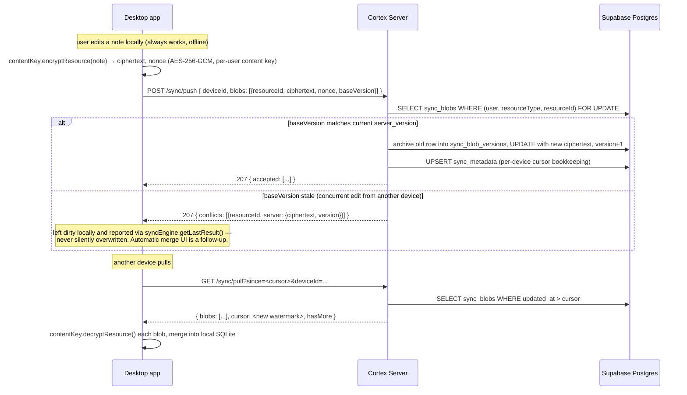
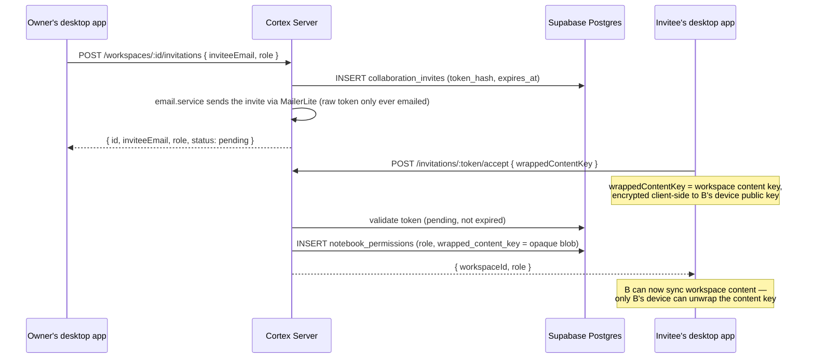
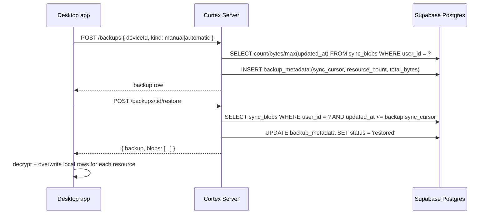

# Cortex Server — Architecture

## 1. Where this fits

Cortex is a local-first Electron app: every user's notes, documents, embeddings, vector
indexes, OCR results, AI conversations, tasks, diagrams, and whiteboards live in a local
SQLite database on their machine (`apps/desktop/src/services/storage/database.js`), encrypted
at rest with a device-local key (`apps/desktop/src/services/storage/keyStore.js`). None of
that changes. `apps/server` is a **separate, optional** service that the desktop app talks
to only when a user explicitly opts in to a cloud account. It is never on the path to
opening the app, searching notes, or running local AI.

```text
┌────────────────────────────────────────┐        ┌───────────────────────────────────┐
│         Cortex Desktop (Electron)       │        │          Cortex Server             │
│                                          │        │        (apps/server, optional)     │
│  Local SQLite: notes, docs, embeddings,  │        │                                     │
│  tasks, diagrams, whiteboards, OCR,      │  HTTPS │  Supabase Postgres: profiles,       │
│  AI conversations — source of truth      │◄──────►│  devices, sync metadata (ciphertext │
│                                          │ (opt-in)│  only), workspaces, invitations,    │
│  Local AI: BGE embeddings, Phi-3/Ollama  │        │  orgs, backups, notifications,      │
│                                          │        │  activity log                       │
│                                          │        │  + Supabase Auth (identity)          │
│                                          │        │  + MailerLite (transactional email)  │
└────────────────────────────────────────┘        └───────────────────────────────────┘
     always works offline                              never required to boot the app
```

Why a separate app instead of a folder inside `apps/desktop`: the server has its own
runtime (long-lived Node process, Postgres connection pool), its own deploy lifecycle, and
its own dependency graph (`express`, `pg`, `@supabase/supabase-js`) that has no business being
bundled into the Electron binary. Keeping it physically separate (own `package.json`) makes
"the desktop app doesn't depend on the backend" a structural fact, not a policy someone has
to remember — and it means the Electron app never links against Supabase's SDK at all: it
only ever talks to `apps/server` over plain HTTP, never to Supabase directly.

**Why Supabase, and why apps/server still exists on top of it:** Supabase provides the
managed Postgres database and the auth/session/password-hashing/token-rotation machinery
(`auth.users`, refresh tokens, email OTPs) so this project doesn't hand-roll any of that.
`apps/server` is not a thin proxy in front of it, though — it's the "Backend API" layer with
its own business logic (device/session bookkeeping, zero-knowledge sync, collaboration roles,
backup snapshots, audit logging, transactional email) that doesn't fit inside Supabase's
Auth/RLS model alone. It connects to Supabase's Postgres with a direct connection string
(via `pg`, unchanged from before Supabase was introduced) and to Supabase Auth via
`@supabase/supabase-js` using a service-role key — see [SECURITY.md](SECURITY.md) for why
that key never leaves this process.

## 2. What the server does and does not store

| Data | Where |
| --- | --- |
| Notes, documents, PDFs, knowledge graph, embeddings, vector indexes, OCR, AI conversations, local settings, tasks, diagrams, whiteboards | **Desktop only** (local SQLite) |
| Email, identity, password (hashed) | **Supabase Auth** (`auth.users`) — this server never sees or stores a password |
| Device list, profile, preferences, subscription status, activity log | **Server** (Supabase Postgres, `public` schema) |
| Sync payloads, backup snapshots | **Server**, but as ciphertext the server cannot decrypt — see [SECURITY.md](SECURITY.md) |
| Friend graph, workspace membership, invitations, organizations, notifications | **Server** (this is inherently server-side coordination state) |
| Transactional email delivery | **MailerLite** — the server renders the email, MailerLite sends it; MailerLite never sees anything except the address + rendered content of that one email |

## 3. Layering (`src/`)

```
routes → controllers → services → repositories → db/pool (pg) / config/supabase.js
                 │
                 ├─ models/        zod request schemas (validated by middleware/validate.js)
                 ├─ middleware/    authenticate, requireWorkspaceRole, rateLimit, errorHandler
                 └─ templates/     MailerLite email templates (shared layout + per-email content)
```

- **routes** wire URL + HTTP verb + middleware to a controller function. No logic.
- **controllers** parse `req`, call exactly one service method, shape the HTTP response.
- **services** hold business rules (conflict detection, invitation expiry, enumeration-safe
  password reset, best-effort email/audit-log dispatch). Services never touch `pg` directly,
  and only `auth.service.js`/`users.service.js` talk to Supabase Auth
  (`config/supabase.js`) — every other service is unaffected by the choice of identity
  provider.
- **repositories** are the only files that import `db/pool` — one file per aggregate. This
  is why swapping the identity provider (bcrypt+JWT → Supabase Auth) barely touched them:
  `sync.repository.js`, `collaboration.repository.js`, `notifications.repository.js`,
  `backup.repository.js` are all still plain `pg` queries against the same Postgres — only
  now it's Supabase's Postgres, and `users`/`devices` FK to `auth.users(id)` instead of a
  locally-defined `users` table.
- This mirrors the desktop app's own separation of `main.js` (thin IPC handlers) from
  `services/storage/database.js` (the only file that touches `better-sqlite3`).

## 4. Authentication flow

Identity, password hashing, session issuance, and refresh-token rotation are all delegated
to **Supabase Auth** — this server verifies Supabase-issued access tokens
(`utils/supabaseToken.js`) and never signs one itself. See [SECURITY.md](SECURITY.md) for
the verification details.



Email verification and password reset both go through Supabase's `admin.generateLink`,
which returns a one-time code (`email_otp`) — the server emails that code itself via
MailerLite rather than relying on Supabase's own SMTP, so every outbound email in this
project (verification, reset, login notification, new-device alert, account deletion
confirmation, workspace invites, product announcements) has one delivery path
(`services/email.service.js`) and one provider (MailerLite).

## 5. Sync flow (zero-knowledge)

The server cannot read note content — it stores ciphertext + a version counter per
`(user, resourceType, resourceId)` and resolves conflicts by version comparison only, never
by content. This part is unchanged by the Supabase migration. See
[SECURITY.md](SECURITY.md) for the encryption model this assumes on the client
(`apps/desktop/src/services/cloud/contentKey.js`, `deviceKeys.js`, `syncEngine.js`).



**Cross-device content key distribution:** the AES key that encrypts sync payloads is a
per-*user* symmetric key (`contentKey.js`), not a per-device or server-held key. The first
device a user enables cloud sync on generates it and uploads a copy wrapped (RSA-OAEP) to
that device's own public key (`PUT /auth/devices/:deviceId/key`, `devices.wrapped_user_key`
— opaque to the server). A second device adopts it the same way workspace collaboration
already does: unwrap a per-device wrapped copy with its own private key
(`deviceKeys.js`). The handshake for "an already-enrolled device notices a *new* device and
wraps a copy for it" isn't built yet — see `syncEngine.js`'s `ensureDeviceEnrolled` docblock.

## 6. Collaboration flow (workspace sharing)

A workspace's content key is generated and wrapped **client-side** — the server stores the
wrapped key as an opaque blob per member and never sees the unwrapped key. Unchanged by the
Supabase migration other than the underlying table name (`notebook_permissions`, was
`workspace_members`; `collaboration_invites`, was `workspace_invitations`).



## 7. Backup flow

A backup is a cheap, named restore point — a pointer at the user's sync cursor — not a
second copy of ciphertext. Restoring replays `sync_blob_versions` at-or-before that cursor.



Automatic backups run once per day from the same background interval that drives sync
(`apps/desktop/src/main/main.js`'s `startCloudSyncLoop`), only while online and only while
cloud sync is enabled.

## 8. Running two processes locally

```bash
# Terminal 1 — desktop app (works with zero setup)
cd apps/desktop && npm start

# Terminal 2 — optional server, only needed to exercise cloud features.
# Requires a Supabase project (see .env.example for SUPABASE_URL / keys) and
# MAILERLITE_API_KEY if EMAIL_PROVIDER=mailerlite; otherwise emails log to stdout.
cd apps/server && npm run migrate && npm run dev
```

The desktop app does not probe for or wait on the server at startup — see
`apps/desktop/src/main/main.js`, where the only network probes are the public-internet
connectivity checks (`checkInternetConnectivity`), not a call to this server.
