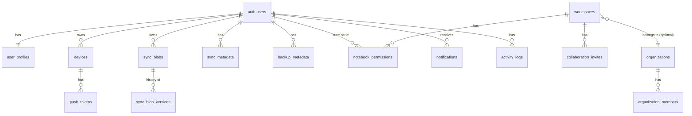

# Cortex Server — Database Schema

Supabase Postgres. Migrations live in `src/db/migrations/*.sql`, applied in filename order
by `npm run migrate` (`src/db/migrate.js`), tracked in a `schema_migrations` table. No ORM —
plain SQL, mirroring the explicit style of the desktop app's own `database.js`. `DATABASE_URL`
points at Supabase's Postgres connection string (project settings → Database), so this is
otherwise a normal Postgres schema you can also browse/edit from Supabase's SQL editor.

Identity lives in Supabase Auth's own `auth.users` table, which these migrations never
create — every table below FKs to it. See [ARCHITECTURE.md](ARCHITECTURE.md) for why the
server still exists on top of Supabase instead of the desktop app talking to Supabase
directly.

## Entity overview

## 001_users.sql — profile + devices

- **user_profiles** `(user_id pk/fk → auth.users, avatar_url, display_name, preferences jsonb, subscription_plan, subscription_status, subscription_renews_at)`
  — one row per user; subscription fields live here rather than a separate table since it's
  a 1:1 relationship.
- **devices** `(id, user_id fk, name, fingerprint, platform, public_key, wrapped_user_key, last_seen_at, revoked_at)`
  — `UNIQUE(user_id, fingerprint)`; re-registering the same fingerprint upserts (see
  `devices.repository.js#upsertDevice`). `public_key` is this device's RSA-OAEP public key
  (`apps/desktop/src/services/cloud/deviceKeys.js`); `wrapped_user_key` is that device's
  encrypted copy of the user's sync content key (`contentKey.js`) — both opaque to the server.

No `users`, `refresh_tokens`, `email_verification_tokens`, or `password_reset_tokens` tables
exist — Supabase Auth's own `auth.users` / session / one-time-token machinery replaces all
of them (`002_auth_tokens.sql` is now an intentional no-op migration, kept so the file
sequence doesn't shift).

## 003_sync.sql — zero-knowledge sync

- **sync_blobs** `(id, user_id, resource_type, resource_id, ciphertext bytea, nonce bytea, server_version int, updated_by_device_id, deleted, updated_at)`
  — `UNIQUE(user_id, resource_type, resource_id)`. `resource_type` is a client-defined string
  (`note`, `page`, and generically extensible to `task`/`whiteboard`/... later); the server
  never branches on it.
- **sync_blob_versions** `(id, blob_id fk, server_version, ciphertext, nonce, updated_by_device_id, created_at)`
  — append-only, one row written per overwrite (see `sync.repository.js#upsertBlob`), powers
  `GET /sync/resource/:type/:id/versions` **and** backup restore (`syncRepo.listAsOf`).
- **sync_metadata** `(id, user_id, device_id, resource_type, last_cursor, last_synced_at, status, last_error)`
  — `UNIQUE(device_id, resource_type)`. Per-device sync *status* bookkeeping, separate from
  the ciphertext above — written after each push (per resource type touched) and each fully-
  drained pull (`resource_type = '_all'`, a wildcard sentinel since pull sweeps every type at
  once).

## 004_collaboration.sql

- **friend_requests** `(requester_id, addressee_id, status)` — `UNIQUE(requester_id, addressee_id)`;
  status: `pending | accepted | declined | blocked`.
- **organizations** / **organization_members** `(organization_id, user_id, role: admin|member)`.
- **workspaces** `(id, owner_id, organization_id nullable, name, kind: notebook|project)`.
- **notebook_permissions** `(workspace_id, user_id, role: owner|editor|viewer, wrapped_content_key)`
  — was `workspace_members`; renamed to match the task's schema naming. `wrapped_content_key`
  is an opaque string the server stores but cannot decrypt; see [SECURITY.md](SECURITY.md).
- **collaboration_invites** `(id, workspace_id, inviter_id, invitee_email, role, token_hash unique, status, expires_at)`
  — was `workspace_invitations`; same shape, renamed for the same reason.

## 005_notifications.sql

- **notifications** `(id, user_id, type, payload jsonb, read_at, created_at)`.
- **push_tokens** `(id, user_id, device_id fk, platform, token)` — `UNIQUE(device_id, token)`.

## 006_backup.sql

- **backup_metadata** `(id, user_id, device_id, kind: manual|automatic, label, sync_cursor, resource_count, total_bytes, status, restored_at)`
  — a backup is a *pointer*, not a duplicate blob store: `sync_cursor` + counts are all that's
  recorded at creation time; restore replays `sync_blob_versions` at-or-before that cursor
  (`backup.service.js`, `sync.repository.js#listAsOf`).

## 007_activity_logs.sql

- **activity_logs** `(id, user_id, action, resource_type, resource_id, metadata jsonb, created_at)`
  — audit trail for security-relevant events (login, device revoked, password reset, sign-out-
  all, invite sent, backup created/restored, ...), written best-effort by
  `activityLog.service.js` — a logging failure never blocks the action it was logging.

## Row Level Security

Every table above has `ENABLE ROW LEVEL SECURITY` plus a policy scoped to `auth.uid()`
(direct ownership) or workspace membership via `notebook_permissions` — see the bottom of
each migration file for the exact policies. `apps/server` connects with the Postgres/service
role and therefore bypasses RLS by design (it does its own authorization in the
middleware/repository layer, e.g. `requireWorkspaceRole`); RLS here is defense-in-depth for
the `anon`/`authenticated` Postgres roles Supabase's PostgREST/Realtime/client SDKs use, in
case of future direct-from-client access — see [SECURITY.md](SECURITY.md).

## Indexes

Every foreign key that's queried directly has a matching index (`idx_devices_user_id`,
`idx_sync_blobs_user_updated` for the incremental pull cursor scan, `idx_notebook_permissions_user`,
`idx_backup_metadata_user_created`, `idx_activity_logs_user_created`, `idx_notifications_user_unread`,
etc.) — see the migration files for the full list next to each table.
