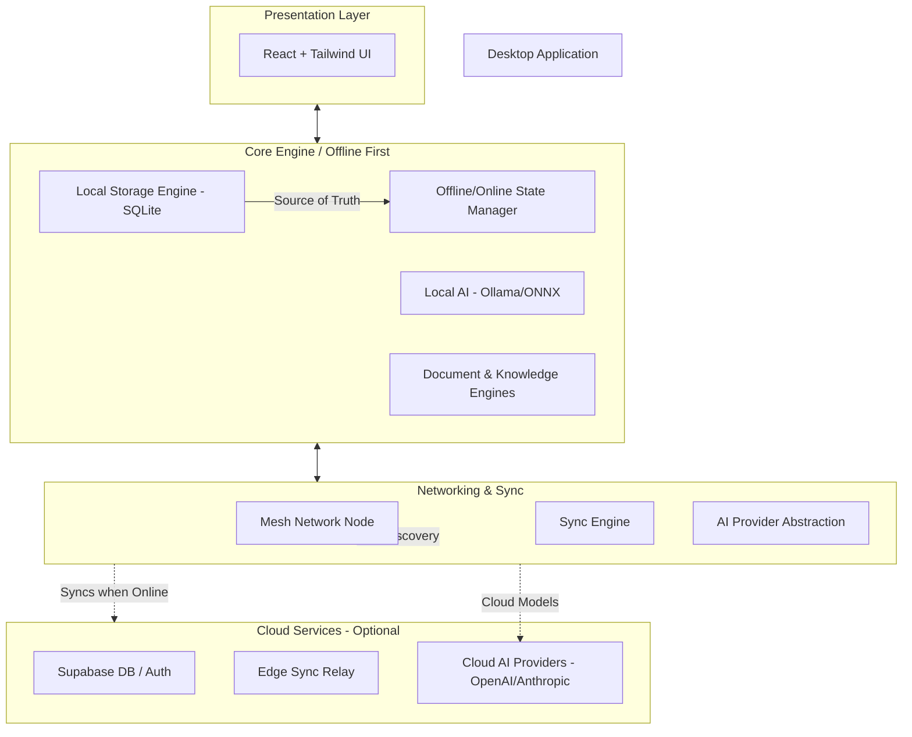

# Cortex Hybrid Offline + Online Architecture

Cortex is designed as a **Hybrid Local-First + Cloud-Enabled AI Knowledge Operating System**. This document outlines the core architecture and philosophies that drive the product.

## Product Philosophy

1. **Offline-first**: Cortex must be fully functional without an internet connection.
2. **Local source of truth**: The local SQLite database is authoritative. All interactions read from and write to the local database.
3. **Cloud is an enhancement**: The internet enhances the experience (syncing, backup, cloud LLMs) but is never required.
4. **Data Ownership**: Users own their data entirely.
5. **Graceful Degradation**: Every feature must degrade gracefully when offline (e.g., falling back from Cloud AI to Local AI).

---

## 1. High-Level Architecture

Cortex is an Electron-based desktop application with the following core pillars:

## 2. Storage & Data Model

Cortex operates on a **Three-Tier Data Ownership Model**:

- **Tier 1 — Local Only**: Data that never leaves the device automatically (Drafts, caches, local temporary files).
- **Tier 2 — Synced**: Data that is end-to-end encrypted (E2EE) and synced securely to the cloud via Supabase for personal multi-device access (Notes, Projects, Knowledge Graph).
- **Tier 3 — Shared**: Data specifically shared with collaborators via Shared Workspaces or Mesh Networking. Encrypted using symmetric workspace keys.

### Local Storage Architecture
- **Engine**: SQLite (`database.js`).
- **Functionality**: Full-text search (FTS5) for querying, local vector store for embeddings, and an operation queue for tracking sync states.

## 3. Synchronization & Conflict Resolution

- **Sync Engine**: The Sync Engine (`syncEngine.js`) queues all local writes in an operation log. When connected, it processes the queue against the Cloud Relay.
- **Conflict Resolution**: Cortex utilizes **Last-Write-Wins (LWW)** with hybrid logical clocks (timestamps) for metadata. Rich text editing utilizes CRDTs (Conflict-free Replicated Data Types) to prevent data loss.
- **Network Awareness**: The app hooks into system network events (`navigator.onLine`) to pause and resume the sync queue transparently.

## 4. AI Provider Abstraction

Cortex unifies interactions with Artificial Intelligence through an abstraction layer (`ai/index.js`):

- **Local AI**: Seamless integration with local models (Ollama, GGUF/llama.cpp) for privacy-preserving, offline inference.
- **Cloud AI**: Bring-Your-Own-Key (BYOK) support for OpenAI, Anthropic, Gemini, Groq, and OpenRouter.
- **Fallback Mechanism**: When the internet drops, AI requests to Cloud providers automatically gracefully degrade, offering to route the request through the active Local AI model instead.
- **Security**: API keys are stored securely using the OS keychain and are *never* synced.

## 5. Mesh Networking (Local P2P)

Cortex supports fully offline collaboration:
- **Discovery**: Local UDP broadcast (Zero-conf) locates peers.
- **Connection**: Direct TCP channels securely exchange signed identities and share Tier 3 (Shared) workspaces without touching the internet.

## 6. Authentication & Security

- **Flow**: Local-first access requires zero authentication. When opting into cloud features, users authenticate via Supabase.
- **Row-Level Security (RLS)**: The cloud backend restricts access so that devices can only read their own encrypted sync payloads.
- **E2EE**: Device-specific sync tokens and symmetric keys are managed heavily to ensure zero-knowledge cloud storage.
